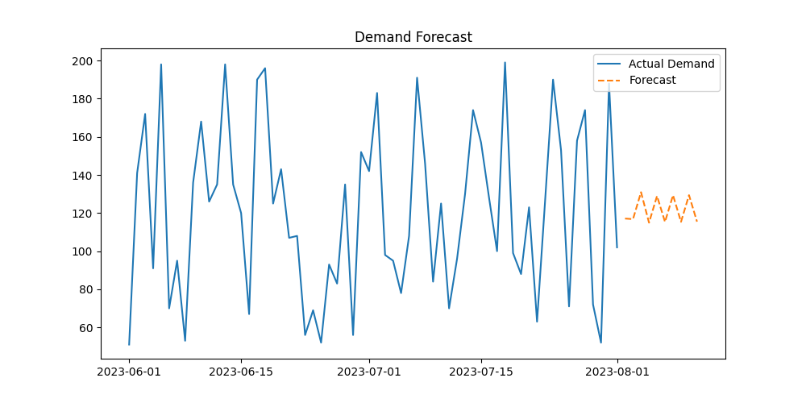

# 📊 Demand Forecasting & Inventory Optimization

## 🚀 Overview

This project builds an end-to-end analytics solution to forecast product demand and optimize inventory decisions.
It combines time series forecasting with inventory optimization techniques to help businesses reduce costs while maintaining service levels.

---

## 🧠 Business Problem

Organizations often struggle with:

* Overstocking → High holding costs
* Understocking → Lost sales & poor customer experience

This project addresses these challenges by:

* Predicting future demand
* Recommending optimal inventory levels
* Quantifying cost trade-offs

---

## ⚙️ Tech Stack

* **Python**
* **Pandas, NumPy** – Data processing
* **Matplotlib** – Visualization
* **Statsmodels (SARIMA)** – Time series forecasting

---

## 🔧 Methodology

### 1. Demand Forecasting

* Time series modeling using **SARIMA**
* Captures trends and seasonality in demand
* Forecasts demand for future periods

### 2. Inventory Optimization

* Calculates:

  * Optimal Order Quantity
  * Reorder Point
  * Safety Stock
* Uses **service level–based approach** to manage uncertainty

### 3. Cost Analysis

* Evaluates:

  * Holding Cost
  * Stockout Cost
* Compares:

  * Naive inventory strategy
  * Optimized inventory strategy

---

## 📊 Results

### 🔹 Demand Forecast

The model successfully forecasts future demand based on historical patterns.

### 🔹 Inventory Decisions

| Metric                 | Value  |
| ---------------------- | ------ |
| Optimal Order Quantity | 237    |
| Reorder Point          | 236.73 |
| Safety Stock           | 115.36 |
| Total Cost             | 561.85 |

---

### 🔹 Cost Comparison

| Scenario            | Cost   |
| ------------------- | ------ |
| Before Optimization | 550.00 |
| After Optimization  | 561.85 |
| Cost Change         | -2.15% |

---

## ⚖️ Key Insight: Cost vs Service Trade-off

The optimized model increases inventory slightly to maintain a higher service level (85%), reducing the risk of stockouts.

This highlights a critical business trade-off:

* Higher service level → Higher cost, fewer stockouts
* Lower service level → Lower cost, higher risk

👉 This analysis enables decision-makers to choose strategies based on business priorities.

---

## 📈 Visualization



---

## ▶️ How to Run

```bash
pip install -r requirements.txt
python src/train.py
```

---

## 📁 Project Structure

```
demand-forecasting/
│── data/
│   └── demand_inventory.csv
│── src/
│   └── train.py
│── requirements.txt
│── README.md
│── .gitignore
```

---

## 🚀 Business Impact

* Enables **data-driven inventory decisions**
* Reduces risk of stockouts and overstocking
* Supports **cost optimization and operational efficiency**
* Demonstrates real-world **supply chain analytics application**

---

## 🔮 Future Enhancements

* Interactive dashboard using Streamlit
* Multi-product forecasting
* Advanced optimization (EOQ, dynamic policies)
* Scenario simulation for different service levels

---

## 👤 Author

**Sivabharathi T**
